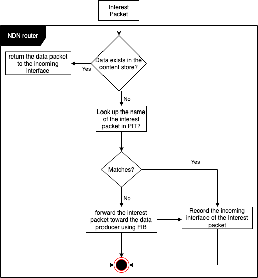

# Named Data Networking
Publisher: ACM SIGCOMM Computer Communication Review 2014  
DOI: [https://doi.org/10.1145/2656877.2656887](https://doi.org/10.1145/2656877.2656887)

# Abstract

# NDN Architecture
In NDN there are two types of packets that data producers and consumers exchange to maintain connection:

    1. Interest packets
    2. Data Packets

**Neither Interest nor Data packets carry any host or interface addresses**

Both types of packet have a name field that indicates a peace of data.
In NDN communication is driven by receivers(data consumers).
A consumer puts the name of the peace of data it needs into an *Interest packet* then sends it to the network.
Once that *Interest packet* reaches a nodes which contains the desired data, then it will return the *Data packet*
that contains the desired data. The *Data packet* traverses the reverse path taken by the *Interest packet*.

To forward packets correctly each NDN router maintain the following data structure:

    1. Pending Interest Table (PIT)
    2. Forwarding Information Base (FIB)
    3. Content Store (CS)
    4. Forwarding Strategy module

1. **Pending Interest Table (PIT)**: The stores all the Interests that a router has forwarded but not satisfied yet. each PIT entry record has the data name carried in the internet in addition to its incoming and outgoing interface(s).

2. **Forwarding Information Base (FIB)**: the FIB decides when and where to forward the Interests.

3. **Content Store (CS)**: The Content Store is a temporary cache of Data packets the router has received.

## Names

Although namespace design and management is not in the scope of the NDN architecture (just like address space is not a part of the IP networks), naming is crucial in the design of the NDN applications. To make namespace to be able to grow independently from the network, a design decision is made that allows each NDN application to choose its own appropriate naming scheme.
*i.e.*NDN names are opaque to the network. Obviously consumers must be able to deterministically construct the name for a desired piece of data without having previously seen the name or the data.

## Data-Centric Security

In NDN data produces must cryptographically sign every Data packet.
That signature allows consumers to trust in data independently from how and where the data is obtained.

## Routing and Forwarding

Routing packets in NDN is based on names which solves three problems of IP networks:

    1. Limited address space
    2. NAT traversal
    3. address management

Despite of different routing schemes, NDN can use current routing algorithms such as link state and distance vector.
Current routing protocols such as OSPF and BGP can be adopted to the NDN.
NDN routers announce name prefixes they are willing to serve instead of IP prefixes which helps routers fill their FIB.
